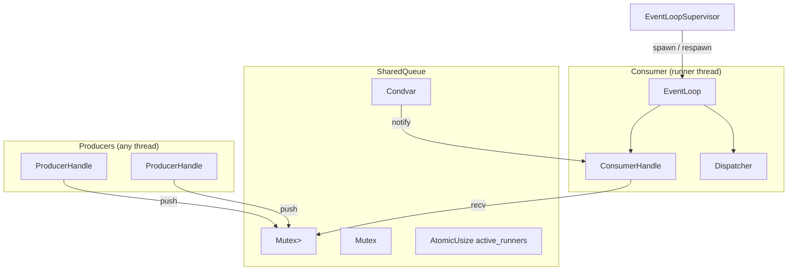

# Storage Event Runtime

This directory documents the storage-layer event runtime, formerly known as the `queue` kernel.

## Documents

- [design.md](design.md) — architecture, invariants, and Mermaid diagrams.
- [usage.md](usage.md) — API examples and usage patterns.
- [storage-integration.md](storage-integration.md) — how the event runtime is wired into `MemoryStore` and collection mutations.

## Quick Overview

The event runtime is a thread-safe, bounded, producer/consumer task queue with:

- Multiple producers pushing concurrently.
- A single consumer runner executing tasks sequentially.
- Lifecycle management for graceful/immediate shutdown.
- An `EventLoopSupervisor` that respawns the runner thread if it dies.

## Mermaid Architecture

