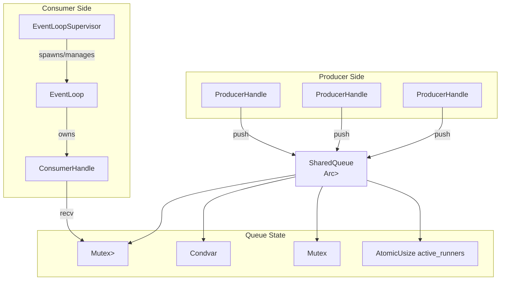
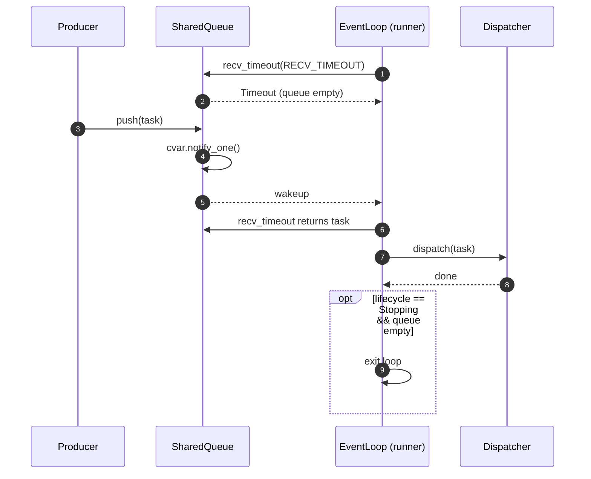
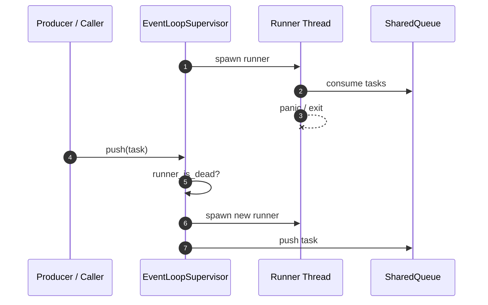

# Storage Event Runtime — Design

This document describes the storage-layer event runtime used by TrenchDB.

## Purpose

The event runtime provides a small, thread-safe event loop kernel for scheduling and executing tasks. It replaces the earlier single-threaded `queue` kernel with a producer/consumer queue that supports multi-threaded access, bounded backpressure, graceful shutdown, and automatic runner supervision.

## Invariants

- Tasks are executed sequentially by a single runner thread.
- Multiple producers may push tasks concurrently.
- The queue is bounded by default to prevent unbounded memory growth.
- A runner thread is automatically respawned if it exits unexpectedly.
- User code may still panic; future work will isolate panics at the dispatch boundary.

## Core Responsibilities

The kernel owns these responsibilities:

- Accept new tasks from multiple producers (`SharedQueue` + `ProducerHandle::push`).
- Execute tasks in FIFO order (`EventLoop::run`).
- Shutdown cleanly via `Lifecycle` stop policies.
- Supervise the runner thread and respawn it if it dies (`EventLoopSupervisor`).

## Internal Structure



### Components

- `SharedQueue<T>` — thread-safe queue shared between producers and consumers.
- `Queue<T>` — internal state: `Mutex<VecDeque<T>>`, `Condvar`, `Mutex<QueueStats>`, and `AtomicUsize` runner counter.
- `ProducerHandle<T>` — allows multiple threads to push tasks concurrently.
- `ConsumerHandle<T>` — allows a runner to block until work is available.
- `EventLoop` — owns a `ConsumerHandle` and dispatches tasks to a `Dispatcher`.
- `EventLoopSupervisor` — owns the runner thread and respawns it on death.
- `Lifecycle` — manages valid state transitions and stop semantics.

## Execution Model



## Lifecycle Integration

```mermaid
stateDiagram-v2
    [*] --> Created: EventLoop::new
    Created --> Running: start()
    Running --> Stopping: request_stop(Graceful)
    Running --> Stopped: request_stop(Immediate)
    Stopping --> Stopped: queue drained / complete_shutdown()
    Stopped --> [*]
```

- `Running` — normal operation; tasks are accepted and executed.
- `Stopping` — no new tasks accepted; existing tasks are drained.
- `Stopped` — loop has exited.

## Supervision Model



## Stop Policies

Two policies are supported via `StopPolicy`:

- `Graceful` — finish remaining queued tasks, then stop.
- `Immediate` — stop as soon as the current receive cycle completes.

## Backpressure

`SharedQueue::with_capacity(n)` creates a bounded queue. When the queue is full, `ProducerHandle::push` returns `PushError::Full(item)` instead of allocating more memory. This prevents memory exhaustion under sustained overload.

## Future Extensions

The following can be layered on top without changing the core:

- Panic isolation at the dispatch boundary.
- Multi-shard event loops with per-core pinning.
- io_uring/epoll-based poller backends.
- Admission control and load shedding.
- Metrics and tracing integration.
