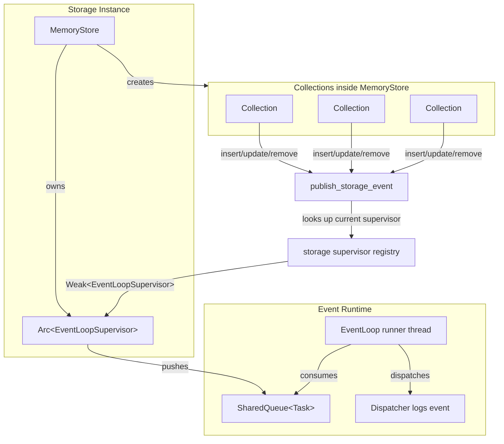

# Storage / Event Runtime Integration

**Date:** 2026-08-09  
**Status:** Implemented  
**Scope:** Ties the storage-layer event runtime to the lifecycle of `storage::memory::MemoryStore` and makes every collection-level mutation publish a task to the event queue.

---

## 1. Why integrate events into the storage lifecycle?

Previously the event supervisor existed only as a standalone object that callers had to create, keep alive, and pass around. Storage code deeper than the top-level API had no convenient way to publish events.

The goal of this integration is:

- Initialize the event queue automatically when a store is created.
- Drop the queue when the store is dropped (data loss on shutdown is accepted for now).
- Let any collection `insert`/`update`/`remove` operation publish an event without receiving a supervisor handle as an argument.

---

## 2. High-level architecture



### Lifecycle flow

1. `MemoryStore::new()` creates an `EventLoopSupervisor` and starts its runner.
2. The supervisor is registered in a storage-specific registry using a `Weak<EventLoopSupervisor>`.
3. Collections call `events::publish_storage_event(payload)` on mutations.
4. Publishing looks up the current supervisor through the registry and pushes a `Task`.
5. When `MemoryStore` drops, it stops the supervisor and unregisters it.

---

## 3. Storage-owned supervisor registry

Because collections cannot carry a supervisor handle without changing every storage trait signature, a lightweight registry lives in `storage/src/events/mod.rs`:

```rust
static STORAGE_EVENT_SUPERVISOR: OnceLock<Mutex<Option<Weak<EventLoopSupervisor>>>> = OnceLock::new();

pub fn register_storage_event_supervisor(supervisor: &Arc<EventLoopSupervisor>);
pub fn unregister_storage_event_supervisor();
pub fn current_storage_event_supervisor() -> Option<Arc<EventLoopSupervisor>>;
```

### Design decisions

- **Weak reference:** prevents the global registry from keeping the supervisor alive after the store is dropped. If the store is gone, collections silently stop publishing events instead of resurrecting the queue.
- **One active supervisor at a time:** the registry stores a single optional entry. Creating a new store overwrites the previous registration. This is intentional for single-store-per-process usage today.
- **Graceful fallback:** if no supervisor is registered, publishing is a no-op rather than a panic.

---

## 4. `MemoryStore` owns the supervisor

```rust
pub struct MemoryStore<K, V> {
    map: DashMap<K, Arc<Collection<K, V>>>,
    event_supervisor: Arc<EventLoopSupervisor>,
}

impl<K, V> MemoryStore<K, V> {
    pub fn new() -> Self {
        let supervisor = Arc::new(EventLoopSupervisor::new(SharedQueue::with_capacity(1024)));
        supervisor.start();
        events::register_storage_event_supervisor(&supervisor);
        /* ... */
    }
}

impl<K, V> Drop for MemoryStore<K, V> {
    fn drop(&mut self) {
        self.event_supervisor.request_stop();
        events::unregister_storage_event_supervisor();
    }
}
```

### Decisions

- **Bounded queue:** capacity is fixed at `1024`. A full queue causes `push` to return `PushError::Full`, which is logged and dropped. This prevents unbounded memory growth under overload.
- **Synchronous `Drop`:** `request_stop()` joins the runner thread. That can block briefly but guarantees the queue stops when the store is destroyed.
- **Data loss is accepted:** when the store drops, tasks still in the queue are lost. This matches the in-memory-only phase of the project.

---

## 5. Collection operations publish events

`storage/src/rec/collections.rs` now publishes a minimal event after each mutation:

| Operation | Event payload |
|---|---|
| `insert` | `"insert"` |
| `update` | `"update"` |
| `remove` | `"delete"` |

These payloads are placeholders for a richer event schema later (table name, key, version, timestamp, etc.).

### Publishing helper

```rust
pub fn publish_storage_event(payload: Vec<u8>) {
    if let Some(supervisor) = current_storage_event_supervisor() {
        let task = Task {
            id: next_task_id(),
            payload,
        };
        if let Err(err) = supervisor.push(task) {
            eprintln!("[storage] failed to publish storage event: {:?}", err);
        }
    }
}
```

Task IDs are generated from a process-wide `AtomicU64` counter.

---

## 6. Supervisor robustness changes

To make the storage-owned supervisor safe to keep alive for the process duration, these changes were made in `storage/src/events/loops.rs`:

### 6.1 Thread spawn failure is handled

`spawn_runner()` returns `Result<JoinHandle<()>, std::io::Error>`:

```rust
fn spawn_runner(&self) -> Result<JoinHandle<()>, std::io::Error> {
    Builder::new().spawn(move || { /* ... */ })
}
```

`push()` now converts spawn failures into `EventLoopSupervisorError::Spawn` instead of panicking.

### 6.2 Runner panics are isolated

The runner thread body is wrapped with `catch_unwind`:

```rust
let result = catch_unwind(AssertUnwindSafe(|| {
    let mut event_loop = EventLoop::new(&queue, lifecycle);
    event_loop.start();
    event_loop.run();
}));
```

If the dispatcher panics, the panic is logged and the thread exits cleanly. The next `push()` will respawn a replacement runner.

### 6.3 Shared lifecycle state

`Lifecycle` was changed from a simple `State` field to an `Arc<Mutex<State>>` so the supervisor and runner thread can both observe and mutate lifecycle state safely.

### 6.4 Shared supervisor state

`EventLoopSupervisor` keeps its `JoinHandle` inside a `Mutex<Option<JoinHandle<()>>>` so `push()`, `start()`, and `request_stop()` can all operate on it without requiring `&mut self`. This is what makes the supervisor usable from a shared `Arc` and from the global registry.

---

## 7. Relationship to the global singleton

The code still exposes a process-wide singleton helper:

```rust
pub fn init_global_event_loop_supervisor(capacity: usize) -> &'static EventLoopSupervisor;
pub fn global_event_loop_supervisor() -> &'static EventLoopSupervisor;
```

This is independent of the storage-owned supervisor. Use it only for code paths that need a long-lived event loop without owning a store.

For storage-layer events, prefer the registry-based publish path (`events::publish_storage_event`).

---

## 8. Tradeoffs and known limitations

| Decision | Benefit | Cost |
|---|---|---|
| Storage owns supervisor | Simple lifecycle; no global coordination | Cannot share one event loop across multiple stores |
| Weak registry | Store drop tears down queue cleanly | Events silently dropped if store is dropped while collections still referenced elsewhere |
| Bounded queue | Prevents memory exhaustion | Bursty writes can overflow and drop events |
| Synchronous `Drop` | Clean shutdown guarantee | `drop` may block on runner join |
| Minimal event payload | Fast to serialize | Not useful for real auditing/replication yet |
| Single active supervisor registry | Simple mental model | Only one `MemoryStore` per process is fully supported today |

---

## 9. Future work

- Replace placeholder payloads with structured events (table, key, old/new version, timestamp).
- Add a queue-backed health check that detects a stalled runner and restarts it only while lifecycle is `Running`.
- Make queue capacity configurable through `NodeConfig`.
- Decide whether to support multiple concurrent stores with separate event loops, or to enforce a single global storage event loop.
- Consider persisting events to an AOF/WAL once persistence is added to the project.

---

## 10. Relevant source files

- `storage/src/events/mod.rs` — registry, publish helper, singleton helpers
- `storage/src/events/loops.rs` — `EventLoop`, `EventLoopSupervisor`, panic isolation, spawn error handling
- `storage/src/events/queue.rs` — `SharedQueue<T>` implementation
- `storage/src/events/dispatcher.rs` — dummy dispatcher that logs tasks
- `storage/src/events/lifecycle.rs` — shared lifecycle state machine
- `storage/src/memory/store.rs` — `MemoryStore` owns and tears down the supervisor
- `storage/src/rec/collections.rs` — collection operations publish events
