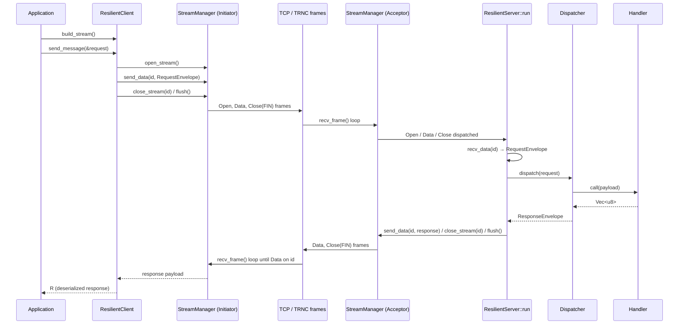

# Transport Layer — Consolidated Documentation

This is the single entry point for everything under `transport/` (the wire
protocol, TCP connection/multiplexing layer) and its application-facing
`ResilientClient` / `ResilientServer` request/response layer. It ties the
per-module deep-dive documents together and gives the end-to-end picture in
one place.

---

## Table of Contents

1. [Document map](#1-document-map)
2. [What this layer is](#2-what-this-layer-is)
3. [Full layer stack](#3-full-layer-stack)
4. [Crate module map](#4-crate-module-map)
5. [Wire format at a glance](#5-wire-format-at-a-glance)
6. [Core primitives, one paragraph each](#6-core-primitives-one-paragraph-each)
7. [Resilient client/server layer, one paragraph each](#7-resilient-clientserver-layer-one-paragraph-each)
8. [End-to-end request walkthrough](#8-end-to-end-request-walkthrough)
9. [Error model summary](#9-error-model-summary)
10. [Status / roadmap](#10-status--roadmap)

---

## 1. Document map

| Document | Covers |
|---|---|
| [`architecture.md`](architecture.md) | Whole-crate overview: layer stack, wire format, frame types, flow control, stream lifecycle, error model, design constraints, what's not implemented |
| [`frame.md`](frame.md) | `frame/` module: `Header`, `Frame`, `Frametype`, `encoder`, `decoder`, validation rules, how to add a new frame type |
| [`connection.md`](connection.md) | `tcp::connection::Connection<T>`: buffered read/write I/O over any `AsyncRead + AsyncWrite` stream |
| [`stream.md`](stream.md) | `tcp::stream::Stream`: per-stream state machine and flow-control windows |
| [`manager.md`](manager.md) | `tcp::manager::StreamManager<T>`: the crate's primary public API — multiplexing, stream IDs, auto-flush, public methods |
| [`receiver.md`](receiver.md) | `tcp::receiver`: stateless handler functions that mutate stream state for each inbound frame type |
| [`resilient.md`](resilient.md) | `client::resilient_client::ResilientClient`, `server::ResilientServer`, `Dispatcher`, `Actions`/`Handler`: the request/response layer built on top of `StreamManager` |

Read `architecture.md` first for the big picture, then drill into the module
you care about. This file is the map between them plus the parts (the
resilient client/server layer) that previously had no consolidated view.

---

## 2. What this layer is

The `transport` crate is TrenchDB's binary framing and connection layer. It
is application-agnostic — it moves opaque byte payloads and knows nothing
about SQL, replication, or cluster state. On top of it, `ResilientClient` and
`ResilientServer` implement one concrete, opinionated usage pattern: a typed
request/response call over a single stream, routed on the server by an
action-name string.

```
transport crate
├── frame/    — TRNC wire format: Header, Frame, encode/decode
├── tcp/      — Connection<T>, Stream, StreamManager<T>, receiver
├── client/   — ResilientClient (request/response client)
├── server/   — ResilientServer, Dispatcher, Actions, Handler
└── errors.rs — TransportError, ErrorCode, ErrorPayload
```

---

## 3. Full layer stack

```
┌─────────────────────────────────────────────────────────────┐
│                     Application Layer                       │
│   (interface crate: EchoHandler, UserMessage, etc.)          │
├─────────────────────────────────────────────────────────────┤
│   ResilientClient              │   ResilientServer            │
│   send_message<T, R>()         │   run() per-connection loop  │
│                                 │   Dispatcher → Actions →     │
│                                 │   Handler::call()            │
│   RequestEnvelope / ResponseEnvelope  (byteser-encoded)       │
├─────────────────────────────────────────────────────────────┤
│           StreamManager<T>                                   │
│   open_stream / send_data / recv_data                        │
│   close_stream / reset_stream / send_ping                     │
├─────────────────────────────────────────────────────────────┤
│           Stream (state + flow control)                      │
│   StreamState machine  │  send/recv windows                  │
├─────────────────────────────────────────────────────────────┤
│           Connection<T>                                      │
│   buffer_frame / flush / recv_frame                           │
├─────────────────────────────────────────────────────────────┤
│           Frame Encoder / Decoder                             │
│   encode() → Bytes   │   decode() → Frame                     │
├─────────────────────────────────────────────────────────────┤
│              TRNC Wire Format                                 │
│   16-byte header + opaque payload                              │
├─────────────────────────────────────────────────────────────┤
│         TLS (rustls) — planned, not yet wired in               │
├─────────────────────────────────────────────────────────────┤
│              TCP (tokio)                                       │
└─────────────────────────────────────────────────────────────┘
```

The two new boxes at the top (`ResilientClient` / `ResilientServer` +
`RequestEnvelope`/`ResponseEnvelope`) are the layer documented in
[`resilient.md`](resilient.md); everything below them was already documented
per-module and is only summarized here.

---

## 4. Crate module map

```
transport/src/
├── lib.rs              — crate root; re-exports frame, errors, tcp, client, server
├── errors.rs            — TransportError, ErrorCode, ErrorPayload
│
├── frame/
│   ├── mod.rs           — re-exports header, frame, encoder, decoder
│   ├── header.rs        — Header struct, wire constants (magic, version, sizes, flags)
│   ├── frame.rs         — Frame struct, Frametype enum
│   ├── encoder.rs       — encode(frame) → Bytes
│   └── decoder.rs       — decode(buf) → Result<(Frame, usize)>
│
├── tcp/
│   ├── mod.rs           — re-exports connection, manager, stream, receiver
│   ├── connection.rs    — Connection<T>: buffered frame I/O
│   ├── stream.rs        — Stream: state machine + flow-control windows
│   ├── manager.rs       — StreamManager<T>: multiplexer, public API
│   └── receiver.rs      — stateless inbound frame dispatch handlers
│
├── client/
│   ├── mod.rs           — pub mod resilient_client;
│   └── resilient_client.rs — ResilientClient
│
└── server/
    ├── mod.rs           — re-exports actions, dispatcher, resilient_server
    ├── actions.rs        — Actions registry + Handler trait
    ├── dispatcher.rs      — Dispatcher: action-name → Handler lookup
    └── resilient_server.rs — ResilientServer, RequestEnvelope, ResponseEnvelope
```

`interface/` is a separate crate that consumes `transport` and demonstrates
both sides of the resilient layer (`interface::client::resilient_client_run`,
`interface::server::run_server`), each with `clap`-based CLI binaries in
`interface/src/bin/`.

---

## 5. Wire format at a glance

Every frame on the wire is a fixed 16-byte header followed by
`payload_length` opaque bytes. Full details, constants, and validation rules
are in [`frame.md`](frame.md) and [`architecture.md §4`](architecture.md#4-wire-format--trnc-framing-protocol).

```
Byte offset   Field            Size    Encoding
───────────   ──────────────   ─────   ─────────────────────────
0 – 3         magic            4 B     "TRNC"
4             version          1 B     u8, currently 1
5 – 6         flags            2 B     u16 big-endian
7 – 10        stream_id        4 B     u32 big-endian
11 – 14       payload_length   4 B     u32 big-endian
15            frame_type       1 B     u8
[16 …]        payload          payload_length bytes
```

Frame types: `Open`, `Data`, `Close`, `Reset`, `Ping`, `Pong`, `Window`,
`Error`, `Settings`, `Hello`, `Welcome` (see [`architecture.md §5`](architecture.md#5-frame-types)).

The resilient layer only ever emits `Open`, `Data`, `Close`, `Reset` frames
directly — `Ping`/`Settings`/`Hello`/`Welcome` are handled (or no-op'd) inside
`StreamManager` itself, below the resilient layer.

---

## 6. Core primitives, one paragraph each

- **`Frame` / `Frametype` / `Header`** ([frame.md](frame.md)) — in-memory
  representation of one TRNC message, the wire constants that define it, and
  the `encode`/`decode` functions that convert to/from bytes. All validation
  (magic, version, size, flag consistency) happens in `Header::validate`.

- **`Connection<T>`** ([connection.md](connection.md)) — the lowest-level
  async I/O wrapper. Buffers outgoing frames (`buffer_frame`/`flush`) and runs
  a decode-then-read loop for incoming frames (`recv_frame`). Knows nothing
  about streams or multiplexing.

- **`Stream`** ([stream.md](stream.md)) — one logical, ordered,
  bidirectional channel: a `StreamState` machine (`Open` →
  `HalfClosedLocal`/`HalfClosedRemote` → `Closed`/`Reset`) plus independent
  credit-based send/receive flow-control windows (default 64 KiB each).

- **`StreamManager<T>`** ([manager.md](manager.md)) — the crate's primary
  public API. Multiplexes any number of `Stream`s over one `Connection<T>`,
  enforces stream-ID parity by `Role` (`Initiator` = odd, `Acceptor` = even),
  auto-flushes once the write buffer crosses 32 KiB, and dispatches inbound
  frames to `receiver` functions.

- **`receiver`** ([receiver.md](receiver.md)) — pure, stateless functions
  (`handle_open`, `handle_data`, `handle_close`, `handle_reset`,
  `handle_window`) that mutate the `streams: HashMap<u32, Stream>` in
  response to each inbound frame type. Testable without any real I/O.

---

## 7. Resilient client/server layer, one paragraph each

Full detail in [`resilient.md`](resilient.md).

- **`ResilientClient`** — holds a target `SocketAddr` and an `Option<TcpStream>`.
  `send_message<T, R>()` builds a *fresh* `StreamManager` around the stored
  socket for each call, opens one stream, sends a serialized `RequestEnvelope`,
  half-closes, blocks until the matching `Data` response arrives, then
  reclaims the raw `TcpStream` for the next call. One request/response round
  trip in flight at a time; no automatic retry or reconnect.

- **`ResilientServer`** — one instance per accepted connection. `run()` builds
  a single long-lived `StreamManager` (`Role::Acceptor`) and `Dispatcher`,
  then loops over `recv_frame`, servicing any number of sequential
  requests — each on its own stream — until the peer disconnects.

- **`RequestEnvelope` / `ResponseEnvelope`** — the two `byteser`-serializable
  structs carried as the payload of the request/response `Data` frames.
  `RequestEnvelope.action` is the routing key; both envelopes' `payload`
  fields are opaque, application-defined bytes.

- **`Dispatcher`** — a thin, stateless wrapper around `Actions` that looks up
  a `RequestEnvelope.action` and awaits the matching `Handler::call`, turning
  a missing action into `TransportError::ActionNotFound`.

- **`Actions` / `Handler`** — an in-memory `HashMap<String, Arc<dyn Handler>>`
  registry. `Handler` is an `async_trait` with a single method,
  `call(&self, payload: Vec<u8>) -> Result<Vec<u8>, TransportError>`; handlers
  own their own request/response (de)serialization.

---

## 8. End-to-end request walkthrough



Every arrow between `SM_C`/`SM_S` and `Wire` is a TRNC frame governed by the
rules in [`frame.md`](frame.md); every state transition inside `SM_S`/`SM_C`
is governed by [`stream.md`](stream.md) and dispatched via
[`receiver.md`](receiver.md).

---

## 9. Error model summary

All fallible operations return `Result<_, TransportError>`
(`transport::errors::TransportError`). The full per-layer tables live in:

- [`architecture.md §11`](architecture.md#11-error-model) — crate-wide error variants and wire-level `ErrorCode`s.
- [`connection.md §7`](connection.md#7-error-conditions) — `Connection<T>` I/O errors.
- [`manager.md §8`](manager.md#8-error-conditions) — `StreamManager<T>` errors.
- [`receiver.md §5`](receiver.md#5-error-conditions) — per-frame-type receiver errors.
- [`resilient.md §10`](resilient.md#10-error-reference) — `ResilientClient`/`ResilientServer`/`Dispatcher` errors, including `ActionNotFound` and the `std::io::Error` variants `send_message` surfaces for `Close`/`Reset`/`Error` frames.

---

## 10. Status / roadmap

Crate-wide gaps (TLS, handshake, `Settings`, `Error`-frame dispatch, timeouts)
are tracked in [`architecture.md §13`](architecture.md#13-what-is-not-implemented-yet).

Resilient-layer-specific gaps — no retry/reconnect, no timeouts, one in-flight
request per client, no structured error response back to the client on a
dispatch failure — are tracked in
[`resilient.md §11`](resilient.md#11-current-limitations).
