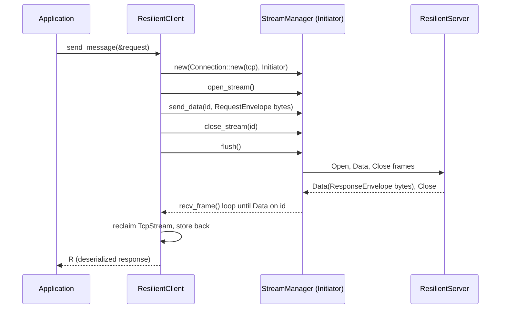
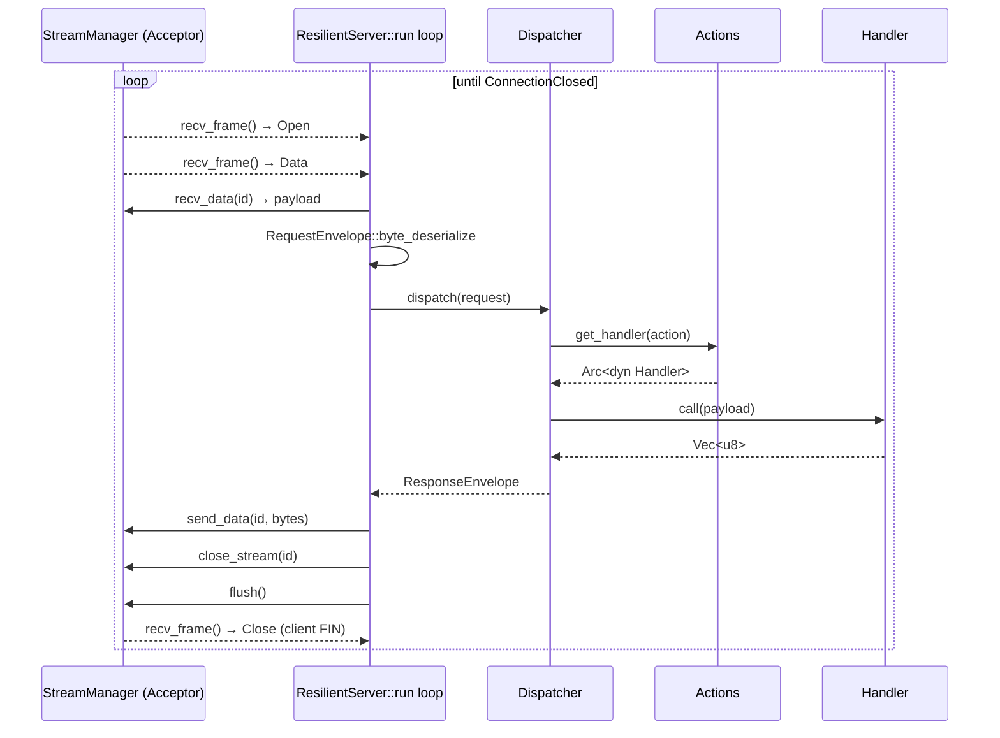
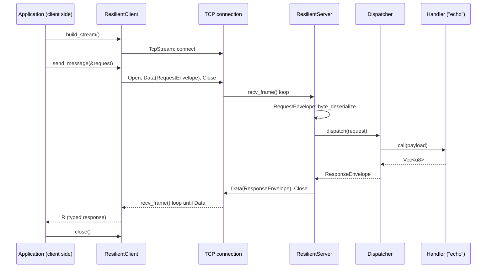

# Resilient Client / Server (`transport::client`, `transport::server`)

The `client::resilient_client` and `server` modules form an **application-facing
request/response layer** built on top of `StreamManager`. Where `StreamManager`
moves opaque frames on arbitrary streams, `ResilientClient` / `ResilientServer`
implement a concrete, opinionated pattern on top of it: *one stream per
request, a typed envelope as the payload, and an action-name-based router on
the server side.*

---

## Table of Contents

1. [Overview](#1-overview)
2. [Module layout](#2-module-layout)
3. [Wire protocol — `RequestEnvelope` / `ResponseEnvelope`](#3-wire-protocol--requestenvelope--responseenvelope)
4. [`ResilientClient`](#4-resilientclient)
   - [Struct layout](#41-struct-layout)
   - [Method reference](#42-method-reference)
   - [Request lifecycle](#43-request-lifecycle)
   - [Connection reuse semantics](#44-connection-reuse-semantics)
5. [`ResilientServer`](#5-resilientserver)
   - [Struct layout](#51-struct-layout)
   - [Method reference](#52-method-reference)
   - [Per-connection loop](#53-per-connection-loop)
6. [`Dispatcher`](#6-dispatcher)
7. [`Actions` and the `Handler` trait](#7-actions-and-the-handler-trait)
8. [End-to-end sequence](#8-end-to-end-sequence)
9. [The `interface` crate — a worked example](#9-the-interface-crate--a-worked-example)
10. [Error reference](#10-error-reference)
11. [Current limitations](#11-current-limitations)

---

## 1. Overview

`ResilientClient` and `ResilientServer` sit one layer above `StreamManager`:

```
┌───────────────────────────────────────────────┐
│              Application Layer                │
│   (interface crate, business handlers)         │
├───────────────────────────────────────────────┤
│   ResilientClient        │   ResilientServer   │
│   Dispatcher / Actions / Handler (server side) │
│   RequestEnvelope / ResponseEnvelope (wire)    │
├───────────────────────────────────────────────┤
│           StreamManager<T>                     │
├───────────────────────────────────────────────┤
│           Connection<T>                        │
├───────────────────────────────────────────────┤
│              TCP (tokio)                       │
└───────────────────────────────────────────────┘
```

The pattern implemented here is intentionally simple:

- The client opens **one stream per request**, writes a single `Data` frame
  containing a serialized `RequestEnvelope`, half-closes the stream, and waits
  for exactly one `Data` frame back.
- The server keeps **one `StreamManager` and one `Dispatcher` alive for the
  lifetime of a TCP connection**, and services any number of sequential
  requests — each on its own stream — until the client disconnects.
- Routing on the server is by **string action name**, resolved through
  `Actions`/`Handler`, so new request types can be added without touching the
  transport or server loop at all.

Despite the name, "resilient" currently refers to the fact that the
underlying TCP connection is **reused across multiple request/response round
trips** rather than reconnected per call — see [§11](#11-current-limitations)
for what is *not* yet implemented (retries, timeouts, reconnection).

---

## 2. Module layout

```
transport/src/
├── client/
│   ├── mod.rs               — pub mod resilient_client;
│   └── resilient_client.rs  — ResilientClient
│
└── server/
    ├── mod.rs               — re-exports actions, dispatcher, resilient_server
    ├── actions.rs           — Actions registry + Handler trait
    ├── dispatcher.rs        — Dispatcher: action-name → Handler lookup
    └── resilient_server.rs  — ResilientServer, RequestEnvelope, ResponseEnvelope
```

Public re-exports (`server/mod.rs`):

```rust
pub use actions::{Actions, Handler};
pub use dispatcher::Dispatcher;
pub use resilient_server::{RequestEnvelope, ResponseEnvelope, ResilientServer};
```

`client/mod.rs` only re-exports the module (`pub mod resilient_client;`), so
callers reach the client via `transport::client::resilient_client::ResilientClient`.

---

## 3. Wire protocol — `RequestEnvelope` / `ResponseEnvelope`

Both envelopes derive `byteser_derive::ByteSerializable`, the crate's binary
(de)serialization derive macro, and are carried as the raw payload of a single
`Data` frame — the transport layer never inspects their contents.

```rust
#[derive(ByteSerializable)]
pub struct RequestEnvelope {
    pub action:  String,   // routing key, looked up in Actions
    pub payload: Vec<u8>,  // application-defined, opaque to the envelope
}

#[derive(ByteSerializable)]
pub struct ResponseEnvelope {
    pub payload: Vec<u8>,  // application-defined, opaque to the envelope
}
```

`payload` inside each envelope is itself expected to be a `byteser`-encoded
application type (see [§9](#9-the-interface-crate--a-worked-example)) — the
envelope only carries the *routing* information (`action`) needed by the
server; everything else is nested, opaque bytes. This keeps `RequestEnvelope`
generic across every action the server registers.

---

## 4. `ResilientClient`

### 4.1 Struct layout

```rust
pub struct ResilientClient {
    sockaddr:   SocketAddr,
    tcp_stream: Option<TcpStream>,
}
```

The socket is stored as an `Option` so it can be `take()`n out, handed to a
short-lived `StreamManager` for the duration of one request, and put back
once the response has arrived.

### 4.2 Method reference

| Method | Description |
|---|---|
| `new(host: String, port: u16) -> Self` | Parses `"{host}:{port}"` into a `SocketAddr` (panics via `.expect` if unparsable). Does **not** connect. |
| `get_socket_addr() -> SocketAddr` | Returns the target address. |
| `build_stream() -> Result<(), _>` | Opens the TCP connection (`TcpStream::connect`) and stores it. Must be called (and succeed) before `send_message`. |
| `send_message<T, R>(&mut self, message: &T) -> Result<R, _>` | Sends one request and returns the typed response. `T` and `R` must implement `byteser::ByteSerializable`. See [§4.3](#43-request-lifecycle). |
| `close() -> Result<(), _>` | Drops the stored `TcpStream`, closing the connection. |

### 4.3 Request lifecycle

`send_message` performs one full request/response round trip on a **new,
short-lived `StreamManager`** built from the connection's existing
`TcpStream`:

```
send_message(message)
  │
  ├─ 1. take() the TcpStream (error: NotConnected if None)
  ├─ 2. StreamManager::new(Connection::new(tcp), Role::Initiator)
  ├─ 3. open_stream()                              → stream_id (always 1st odd id: 1)
  ├─ 4. message.byte_serialize(&mut bytes)
  ├─ 5. send_data(stream_id, bytes)
  ├─ 6. close_stream(stream_id)                     (sends Close/FIN)
  ├─ 7. flush()
  │
  ├─ 8. loop { manager.recv_frame() }
  │      • frame.stream_id != stream_id             → continue (ignore)
  │      • Frametype::Data                          → break with payload
  │      • Frametype::Close                         → Err(BrokenPipe)
  │      • Frametype::Reset                         → Err(ConnectionReset)
  │      • Frametype::Error                         → Err(Other)
  │      • anything else                             → continue
  │
  ├─ 9. tcp = manager.into_connection().into_inner() — reclaim the TcpStream
  ├─ 10. self.tcp_stream = Some(tcp)                 — store it back for reuse
  └─ 11. R::byte_deserialize(&response_payload)      → return typed response
```



### 4.4 Connection reuse semantics

The TCP socket, not the `StreamManager`, is the thing that persists across
calls. Each `send_message` call constructs a **fresh** `StreamManager`, so:

- Stream-ID bookkeeping restarts at `1` every call — `ResilientClient` never
  has more than one stream open at a time from its own perspective.
- Calls to `send_message` are effectively **serialized request/response
  round trips** over one long-lived connection, not concurrent/multiplexed
  requests.
- If a call returns an error, the `TcpStream` is *not* restored to
  `self.tcp_stream` (it was `take()`n and the manager/connection is dropped
  on the error path), so the client will report `NotConnected` on the next
  call — `build_stream()` must be invoked again to reconnect.

---

## 5. `ResilientServer`

### 5.1 Struct layout

```rust
pub struct ResilientServer {
    stream:  TcpStream,
    peer:    SocketAddr,
    actions: Arc<Actions>,
}
```

One `ResilientServer` is constructed per **accepted TCP connection**; `actions`
is shared (via `Arc`) across every connection so the action registry only
needs to be built once at startup.

### 5.2 Method reference

| Method | Description |
|---|---|
| `new(stream, peer, actions: Arc<Actions>) -> Self` | Wraps an accepted socket. |
| `run(self) -> Result<(), Box<dyn Error + Send + Sync>>` | Consumes `self` and drives the connection until the peer disconnects or an unrecoverable error occurs. Intended to be spawned as its own task per connection. |
| `handle_request(dispatcher, request) -> Result<ResponseEnvelope, TransportError>` | Associated function; thin wrapper that calls `dispatcher.dispatch(request)` and repackages the result as a `ResponseEnvelope`. |

### 5.3 Per-connection loop

`run` builds **one** `StreamManager` (`Role::Acceptor`) and **one**
`Dispatcher` for the entire lifetime of the connection, then loops on
`recv_frame`:

```
run(self)
  │
  ├─ StreamManager::new(Connection::new(stream), Acceptor)
  ├─ Dispatcher::new(actions.clone())
  │
  └─ loop:
       recv_frame()
         ├─ Err(ConnectionClosed) → log, return Ok(())      (normal shutdown)
         ├─ Err(other)            → return Err(other)
         └─ Ok(frame) → match frame.frame_type:
              Open   → log "stream N opened"
              Close  → log "stream N closed by client"
              Reset  → log "stream N reset by client"
              Data   →
                recv_data(stream_id)                         → payload
                (skip if payload empty)
                RequestEnvelope::byte_deserialize(payload)    → request
                handle_request(&dispatcher, request)          → response
                response.byte_serialize()                     → bytes
                send_data(stream_id, bytes)
                close_stream(stream_id)
                flush()
              other  → log "received unexpected frame type"
```



A malformed `RequestEnvelope` (deserialization failure) turns into
`TransportError::InternalError`, which propagates out of `run` and ends the
connection — there is currently no per-request error response sent back to
the client in that case (see [§11](#11-current-limitations)).

---

## 6. `Dispatcher`

```rust
pub struct Dispatcher {
    actions: Arc<Actions>,
}

impl Dispatcher {
    pub fn new(actions: Arc<Actions>) -> Self;

    pub async fn dispatch(
        &self,
        request: RequestEnvelope,
    ) -> Result<ResponseEnvelope, TransportError>;
}
```

`dispatch` is a single lookup-and-call:

1. Look up `request.action` in `actions` via `Actions::get_handler`.
2. If found, `await` the handler's `call(request.payload)` and wrap the
   result in a `ResponseEnvelope`.
3. If not found, return `TransportError::ActionNotFound(action_name)`.

The `Dispatcher` itself has no state beyond the shared `Actions` registry —
it can be constructed cheaply per connection (as `ResilientServer::run`
does).

---

## 7. `Actions` and the `Handler` trait

```rust
#[async_trait]
pub trait Handler: Send + Sync {
    async fn call(&self, payload: Vec<u8>) -> Result<Vec<u8>, TransportError>;
}

pub struct Actions {
    action_map: HashMap<String, Arc<dyn Handler>>,
}

impl Actions {
    pub fn new() -> Self;
    pub fn register_action<H: Handler + 'static>(&mut self, action_name: &str, handler: H);
    pub fn get_handler(&self, action_name: &str) -> Option<Arc<dyn Handler>>;
}
```

- `Handler` is an `async_trait` so implementations can `await` inside `call`
  (e.g. to touch the storage engine) without the caller needing to know the
  concrete future type.
- Handlers operate on raw `Vec<u8>` — they are responsible for deserializing
  their own expected request type from `payload` and serializing their own
  response type back into bytes. The `action` string is the only thing the
  transport layer uses for routing; it is otherwise meaningless to `Actions`.
- Registration is imperative and typically done once at startup:

```rust
let mut actions = Actions::new();
actions.register_action("echo", EchoHandler);
let actions = Arc::new(actions); // shared across all ResilientServer instances
```

---

## 8. End-to-end sequence



---

## 9. The `interface` crate — a worked example

`interface/` demonstrates the full stack end-to-end with an `echo` action:

- [`interface/src/server.rs`](../../interface/src/server.rs) — defines
  `EchoHandler` (implements `Handler`), registers it under `"echo"`, and
  runs an accept loop that spawns one `ResilientServer::run` task per
  connection.
- [`interface/src/client.rs`](../../interface/src/client.rs) —
  `resilient_client_run` builds a `ResilientClient`, wraps an application
  struct (`UserMessage`) in a `RequestEnvelope { action: "echo", .. }`, calls
  `send_message`, and deserializes the typed `ServerResponse`.
- [`interface/src/bin/client.rs`](../../interface/src/bin/client.rs) /
  [`interface/src/bin/server.rs`](../../interface/src/bin/server.rs) —
  `clap`-based CLI entry points (`--addr`, `--message`) that drive the two
  functions above on a `tokio` multi-thread runtime.

Application-level types (`UserMessage`, `ServerResponse`, `User`) derive
`byteser_derive::ByteSerializable` directly — they are serialized into
`RequestEnvelope.payload` / `ResponseEnvelope.payload` by the caller, one
layer above the transport's own envelope framing.

A minimal round trip test also lives in
[`transport/src/server/resilient_server.rs`](../../transport/src/server/resilient_server.rs)
(`resilient_server_echoes_request`), using an in-process `TcpListener` bound
to `127.0.0.1:0`.

---

## 10. Error reference

| Error | Raised by | Cause |
|---|---|---|
| `std::io::Error(NotConnected)` | `ResilientClient::send_message` | Called before `build_stream()`, or after a previous call failed and left `tcp_stream == None` |
| `std::io::Error(BrokenPipe)` | `ResilientClient::send_message` | Server sent `Close` before any `Data` frame on the stream |
| `std::io::Error(ConnectionReset)` | `ResilientClient::send_message` | Server sent `Reset` on the stream |
| `std::io::Error(Other)` | `ResilientClient::send_message` | Server sent an `Error` frame on the stream |
| `TransportError::ActionNotFound(action)` | `Dispatcher::dispatch` | `request.action` has no registered handler in `Actions` |
| `TransportError::InternalError(msg)` | `ResilientServer::run`, `EchoHandler` examples | `byteser` (de)serialization failure of `RequestEnvelope`/application payload |
| `TransportError::ConnectionClosed` | `ResilientServer::run` | Peer closed the TCP connection cleanly; treated as normal shutdown, not propagated as an error |
| Any `TransportError` from `StreamManager`/`Connection` | both | See the error tables in [`architecture.md`](architecture.md#11-error-model) and [`manager.md`](manager.md#8-error-conditions) |

---

## 11. Current limitations

These gaps exist today and are useful to know when building on top of this
layer:

| Gap | Detail |
|---|---|
| No retry / reconnect | A failed `send_message` leaves the client disconnected; the caller must call `build_stream()` again manually. There is no automatic retry or backoff despite the "resilient" name. |
| No timeouts | `send_message`'s `recv_frame` loop and `run`'s loop both block indefinitely; a hung or silent peer will stall the caller forever (`TransportError::Timeout` exists but is not wired up here). |
| One in-flight request per client | Each `send_message` call opens and fully closes its own stream before returning; `ResilientClient` does not pipeline or multiplex multiple concurrent requests over one connection. |
| No structured error response to the client | If `RequestEnvelope` deserialization or dispatch fails on the server, the connection's `run` loop returns an `Err` and terminates — no `Error` frame is currently sent back describing the failure. |
| No TLS | Connections are plain TCP; see [`architecture.md §13`](architecture.md#13-what-is-not-implemented-yet) for the crate-wide TLS status. |
